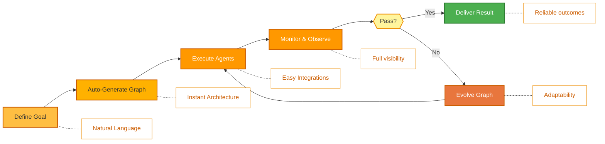
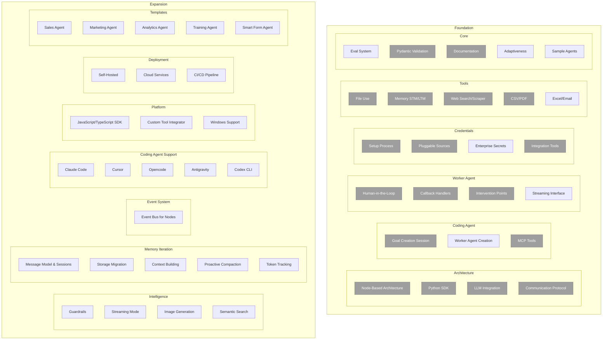

<p align="center">
  
</p>

<p align="center">
  <a href="README.md">English</a> |
  <a href="docs/i18n/zh-CN.md">简体中文</a> |
  <a href="docs/i18n/es.md">Español</a> |
  <a href="docs/i18n/hi.md">हिन्दी</a> |
  <a href="docs/i18n/pt.md">Português</a> |
  <a href="docs/i18n/ja.md">日本語</a> |
  <a href="docs/i18n/ru.md">Русский</a> |
  <a href="docs/i18n/ko.md">한국어</a>
</p>

<p align="center">
  <a href="https://github.com/adenhq/hive/blob/main/LICENSE"></a>
  <a href="https://www.ycombinator.com/companies/aden"></a>
  <a href="https://discord.com/invite/MXE49hrKDk"></a>
  <a href="https://x.com/aden_hq"></a>
  <a href="https://www.linkedin.com/company/teamaden/"></a>
  
</p>

<p align="center">
  
  
  
  
  
</p>
<p align="center">
  
  
  
</p>

## Overview

Build autonomous, reliable, self-improving AI agents without hardcoding workflows. Define your goal through conversation with a coding agent, and the framework generates a node graph with dynamically created connection code. When things break, the framework captures failure data, evolves the agent through the coding agent, and redeploys. Built-in human-in-the-loop nodes, credential management, and real-time monitoring give you control without sacrificing adaptability.

Visit [adenhq.com](https://adenhq.com) for complete documentation, examples, and guides.

https://github.com/user-attachments/assets/846c0cc7-ffd6-47fa-b4b7-495494857a55

## Who Is Hive For?

Hive is designed for developers and teams who want to build **production-grade AI agents** without manually wiring complex workflows.

Hive is a good fit if you:

- Want AI agents that **execute real business processes**, not demos
- Prefer **goal-driven development** over hardcoded workflows
- Need **self-healing and adaptive agents** that improve over time
- Require **human-in-the-loop control**, observability, and cost limits
- Plan to run agents in **production environments**

Hive may not be the best fit if you’re only experimenting with simple agent chains or one-off scripts.

## When Should You Use Hive?

Use Hive when you need:

- Long-running, autonomous agents
- Strong guardrails, process, and controls
- Continuous improvement based on failures
- Multi-agent coordination
- A framework that evolves with your goals

## Quick Links

- **[Documentation](https://docs.adenhq.com/)** - Complete guides and API reference
- **[Self-Hosting Guide](https://docs.adenhq.com/getting-started/quickstart)** - Deploy Hive on your infrastructure
- **[Changelog](https://github.com/adenhq/hive/releases)** - Latest updates and releases
- **[Roadmap](docs/roadmap.md)** - Upcoming features and plans
- **[Report Issues](https://github.com/adenhq/hive/issues)** - Bug reports and feature requests
- **[Contributing](CONTRIBUTING.md)** - How to contribute and submit PRs

## Quick Start

### Prerequisites

- Python 3.11+ for agent development
- Claude Code, Codex CLI, or Cursor for utilizing agent skills

> **Note for Windows Users:** It is strongly recommended to use **WSL (Windows Subsystem for Linux)** or **Git Bash** to run this framework. Some core automation scripts may not execute correctly in standard Command Prompt or PowerShell.

### Installation

```bash
# Clone the repository
git clone https://github.com/adenhq/hive.git
cd hive

# Run quickstart setup
./quickstart.sh
```

This sets up:

- **framework** - Core agent runtime and graph executor (in `core/.venv`)
- **aden_tools** - MCP tools for agent capabilities (in `tools/.venv`)
- **credential store** - Encrypted API key storage (`~/.hive/credentials`)
- **LLM provider** - Interactive default model configuration
- All required Python dependencies with `uv`

### Build Your First Agent

```bash
# Build an agent using Claude Code
claude> /hive

# Test your agent
claude> /hive-debugger

# (at separate terminal) Launch the interactive dashboard
hive tui

# Or run directly
hive run exports/your_agent_name --input '{"key": "value"}'
```
##  Coding Agent Support
### Codex CLI
Hive includes native support for [OpenAI Codex CLI](https://github.com/openai/codex) (v0.101.0+).

1. **Config:** `.codex/config.toml` with `agent-builder` MCP server (tracked in git)
2. **Skills:** `.agents/skills/` symlinks to Hive skills (tracked in git)
3. **Launch:** Run `codex` in the repo root, then type `use hive`

Example:
```
codex> use hive
```

### Opencode 
Hive includes native support for [Opencode](https://github.com/opencode-ai/opencode).

1. **Setup:** Run the quickstart script 
2. **Launch:** Open Opencode in the project root.
3. **Activate:** Type `/hive` in the chat to switch to the Hive Agent.
4. **Verify:** Ask the agent *"List your tools"* to confirm the connection.

The agent has access to all Hive skills and can scaffold agents, add tools, and debug workflows directly from the chat.

**[📖 Complete Setup Guide](docs/environment-setup.md)** - Detailed instructions for agent development

### Antigravity IDE Support

Skills and MCP servers are also available in [Antigravity IDE](https://antigravity.google/) (Google's AI-powered IDE). **Easiest:** open a terminal in the hive repo folder and run (use `./` — the script is inside the repo):

```bash
./scripts/setup-antigravity-mcp.sh
```

**Important:** Always restart/refresh Antigravity IDE after running the setup script—MCP servers only load on startup. After restart, **agent-builder** and **tools** MCP servers should connect. Skills are under `.agent/skills/` (symlinks to `.claude/skills/`). See [docs/antigravity-setup.md](docs/antigravity-setup.md) for manual setup and troubleshooting.

## Features

- **[Goal-Driven Development](docs/key_concepts/goals_outcome.md)** - Define objectives in natural language; the coding agent generates the agent graph and connection code to achieve them
- **[Adaptiveness](docs/key_concepts/evolution.md)** - Framework captures failures, calibrates according to the objectives, and evolves the agent graph
- **[Dynamic Node Connections](docs/key_concepts/graph.md)** - No predefined edges; connection code is generated by any capable LLM based on your goals
- **SDK-Wrapped Nodes** - Every node gets shared memory, local RLM memory, monitoring, tools, and LLM access out of the box
- **[Human-in-the-Loop](docs/key_concepts/graph.md#human-in-the-loop)** - Intervention nodes that pause execution for human input with configurable timeouts and escalation
- **Real-time Observability** - WebSocket streaming for live monitoring of agent execution, decisions, and node-to-node communication
- **Interactive TUI Dashboard** - Terminal-based dashboard with live graph view, event log, and chat interface for agent interaction
- **Cost & Budget Control** - Set spending limits, throttles, and automatic model degradation policies
- **Production-Ready** - Self-hostable, built for scale and reliability

## Integration

<a href="https://github.com/adenhq/hive/tree/main/tools/src/aden_tools/tools"></a>

Hive is built to be model-agnostic and system-agnostic.

- **LLM flexibility** - Hive Framework is designed to support various types of LLMs, including hosted and local models through LiteLLM-compatible providers.
- **Business system connectivity** - Hive Framework is designed to connect to all kinds of business systems as tools, such as CRM, support, messaging, data, file, and internal APIs via MCP.


## Why Aden

Hive focuses on generating agents that run real business processes rather than generic agents. Instead of requiring you to manually design workflows, define agent interactions, and handle failures reactively, Hive flips the paradigm: **you describe outcomes, and the system builds itself**—delivering an outcome-driven, adaptive experience with an easy-to-use set of tools and integrations.



### The Hive Advantage

| Traditional Frameworks     | Hive                                   |
| -------------------------- | -------------------------------------- |
| Hardcode agent workflows   | Describe goals in natural language     |
| Manual graph definition    | Auto-generated agent graphs            |
| Reactive error handling    | Outcome-evaluation and adaptiveness    |
| Static tool configurations | Dynamic SDK-wrapped nodes              |
| Separate monitoring setup  | Built-in real-time observability       |
| DIY budget management      | Integrated cost controls & degradation |

### How It Works

1. **[Define Your Goal](docs/key_concepts/goals_outcome.md)** → Describe what you want to achieve in plain English
2. **Coding Agent Generates** → Creates the [agent graph](docs/key_concepts/graph.md), connection code, and test cases
3. **[Workers Execute](docs/key_concepts/worker_agent.md)** → SDK-wrapped nodes run with full observability and tool access
4. **Control Plane Monitors** → Real-time metrics, budget enforcement, policy management
5. **[Adaptiveness](docs/key_concepts/evolution.md)** → On failure, the system evolves the graph and redeploys automatically

## Run Agents

The `hive` CLI is the primary interface for running agents.

```bash
# Browse and run agents interactively (Recommended)
hive tui

# Run a specific agent directly
hive run exports/my_agent --input '{"task": "Your input here"}'

# Run a specific agent with the TUI dashboard
hive run exports/my_agent --tui

# Interactive REPL
hive shell
```

The TUI scans both `exports/` and `examples/templates/` for available agents.

> **Using Python directly (alternative):** You can also run agents with `PYTHONPATH=exports uv run python -m agent_name run --input '{...}'`

See [environment-setup.md](docs/environment-setup.md) for complete setup instructions.

## Documentation

- **[Developer Guide](docs/developer-guide.md)** - Comprehensive guide for developers
- [Getting Started](docs/getting-started.md) - Quick setup instructions
- [TUI Guide](docs/tui-selection-guide.md) - Interactive dashboard usage
- [Configuration Guide](docs/configuration.md) - All configuration options
- [Architecture Overview](docs/architecture/README.md) - System design and structure

## Roadmap

Aden Hive Agent Framework aims to help developers build outcome-oriented, self-adaptive agents. See [roadmap.md](docs/roadmap.md) for details.



## Contributing

We welcome contributions from the community! We’re especially looking for help building tools, integrations, and example agents for the framework ([check #2805](https://github.com/adenhq/hive/issues/2805)). If you’re interested in extending its functionality, this is the perfect place to start. Please see [CONTRIBUTING.md](CONTRIBUTING.md) for guidelines.

**Important:** Please get assigned to an issue before submitting a PR. Comment on an issue to claim it, and a maintainer will assign you. Issues with reproducible steps and proposals are prioritized. This helps prevent duplicate work.

1. Find or create an issue and get assigned
2. Fork the repository
3. Create your feature branch (`git checkout -b feature/amazing-feature`)
4. Commit your changes (`git commit -m 'Add amazing feature'`)
5. Push to the branch (`git push origin feature/amazing-feature`)
6. Open a Pull Request

## Community & Support

We use [Discord](https://discord.com/invite/MXE49hrKDk) for support, feature requests, and community discussions.

- Discord - [Join our community](https://discord.com/invite/MXE49hrKDk)
- Twitter/X - [@adenhq](https://x.com/aden_hq)
- LinkedIn - [Company Page](https://www.linkedin.com/company/teamaden/)

## Join Our Team

**We're hiring!** Join us in engineering, research, and go-to-market roles.

[View Open Positions](https://jobs.adenhq.com/a8cec478-cdbc-473c-bbd4-f4b7027ec193/applicant)

## Security

For security concerns, please see [SECURITY.md](SECURITY.md).

## License

This project is licensed under the Apache License 2.0 - see the [LICENSE](LICENSE) file for details.

## Frequently Asked Questions (FAQ)

**Q: What LLM providers does Hive support?**

Hive supports 100+ LLM providers through LiteLLM integration, including OpenAI (GPT-4, GPT-4o), Anthropic (Claude models), Google Gemini, DeepSeek, Mistral, Groq, and many more. Simply set the appropriate API key environment variable and specify the model name.

**Q: Can I use Hive with local AI models like Ollama?**

Yes! Hive supports local models through LiteLLM. Simply use the model name format `ollama/model-name` (e.g., `ollama/llama3`, `ollama/mistral`) and ensure Ollama is running locally.

**Q: What makes Hive different from other agent frameworks?**

Hive generates your entire agent system from natural language goals using a coding agent—you don't hardcode workflows or manually define graphs. When agents fail, the framework automatically captures failure data, [evolves the agent graph](docs/key_concepts/evolution.md), and redeploys. This self-improving loop is unique to Aden.

**Q: Is Hive open-source?**

Yes, Hive is fully open-source under the Apache License 2.0. We actively encourage community contributions and collaboration.

**Q: Can Hive handle complex, production-scale use cases?**

Yes. Hive is explicitly designed for production environments with features like automatic failure recovery, real-time observability, cost controls, and horizontal scaling support. The framework handles both simple automations and complex multi-agent workflows.

**Q: Does Hive support human-in-the-loop workflows?**

Yes, Hive fully supports [human-in-the-loop](docs/key_concepts/graph.md#human-in-the-loop) workflows through intervention nodes that pause execution for human input. These include configurable timeouts and escalation policies, allowing seamless collaboration between human experts and AI agents.

**Q: What programming languages does Hive support?**

The Hive framework is built in Python. A JavaScript/TypeScript SDK is on the roadmap.

**Q: Can Hive agents interact with external tools and APIs?**

Yes. Aden's SDK-wrapped nodes provide built-in tool access, and the framework supports flexible tool ecosystems. Agents can integrate with external APIs, databases, and services through the node architecture.

**Q: How does cost control work in Hive?**

Hive provides granular budget controls including spending limits, throttles, and automatic model degradation policies. You can set budgets at the team, agent, or workflow level, with real-time cost tracking and alerts.

**Q: Where can I find examples and documentation?**

Visit [docs.adenhq.com](https://docs.adenhq.com/) for complete guides, API reference, and getting started tutorials. The repository also includes documentation in the `docs/` folder and a comprehensive [developer guide](docs/developer-guide.md).

**Q: How can I contribute to Aden?**

Contributions are welcome! Fork the repository, create your feature branch, implement your changes, and submit a pull request. See [CONTRIBUTING.md](CONTRIBUTING.md) for detailed guidelines.

**Q: When will my team start seeing results from Aden's adaptive agents?**

Aden's adaptation loop begins working from the first execution. When an agent fails, the framework captures the failure data, helping developers evolve the agent graph through the coding agent. How quickly this translates to measurable results depends on the complexity of your use case, the quality of your goal definitions, and the volume of executions generating feedback.

**Q: How does Hive compare to other agent frameworks?**

Hive focuses on generating agents that run real business processes, rather than generic agents. This vision emphasizes outcome-driven design, adaptability, and an easy-to-use set of tools and integrations.

---

<p align="center">
  Made with 🔥 Passion in San Francisco
</p>
